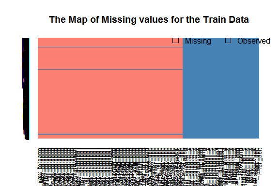
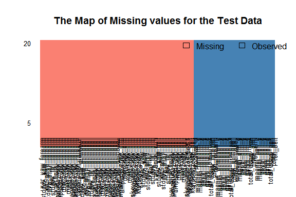

# Practical Machine Learning Course Project
Nataly Rekuz  
July 9, 2016  


## Introduction


Using devices such as Jawbone Up, Nike FuelBand, and Fitbit it is now possible to collect a large amount of data about personal activity relatively inexpensively. These type of devices are part of the quantified self movement – a group of enthusiasts who take measurements about themselves regularly to improve their health, to find patterns in their behavior, or because they are tech geeks. 

One thing that people regularly do is quantify how much of a particular activity they do, but they rarely quantify how well they do it.


## Synopsis


The 6 participants were asked to perform barbell lifts correctly and incorrectly in 5 different ways.More information is available from the website [here](http://groupware.les.inf.puc-rio.br/har) (see the section on the Weight Lifting Exercise Dataset).

In this project, our goal was to use data from accelerometers on the belt, forearm, arm, and dumbell of participants to predict the manner in which they did the exercise. 

We used boosting with trees and random forests methods to predict the outcome. 
We used the parallel processing capabilities of the `parallel` package to improve processing time that some functions require.

The random forest method is way better than boosting with trees. The estimated accuracy of the random forest model is 99.37%, so the estimated out-of-sample error is 0.63%.

The accuracy at predicting the 20 cases for the validation data set is 100% (result of submitting predictions to the Course Project Prediction Quiz for automated grading).


## 1. Data Processing and Exploratory Data Analysis


### 1.1 Load Packages, Download and Read Data  


```r
library(plyr)
library(dplyr)
library(data.table)
library(Amelia)
library(caTools)
library(caret)
library(parallel)
library(doParallel)
library(randomForest)
```


```r
train_url <-"https://d396qusza40orc.cloudfront.net/predmachlearn/pml-training.csv"
test_url <- "https://d396qusza40orc.cloudfront.net/predmachlearn/pml-testing.csv"
train_file <- "./data/pml-training.csv"
test_file  <- "./data/pml-testing.csv"
if (!file.exists("./data")) {
    dir.create("./data")
}
if (!file.exists(train_file)) {
    download.file(train_url, destfile = train_file)
}
if (!file.exists(test_file)) {
    download.file(test_url, destfile = test_file)
}
```

  

```r
train_raw <- fread("./data/pml-training.csv", na.strings = c("NA", ""))
valid_raw <- fread("./data/pml-testing.csv", na.strings = c("NA", ""))
```

Let's look through the data sets for the initial evaluation.


```r
glimpse(train_raw)
glimpse(valid_raw)
```

The training data set contains 160 variables and 19622 observations.

The validation data contains 160 variables and 20 observations.

Both training and validation sets contain lots of variables with NA's.


### 1.2 Clean Data

Let's define whether the sets contain some different variables.


```r
match(names(train_raw), names(valid_raw))
```

```
##   [1]   1   2   3   4   5   6   7   8   9  10  11  12  13  14  15  16  17
##  [18]  18  19  20  21  22  23  24  25  26  27  28  29  30  31  32  33  34
##  [35]  35  36  37  38  39  40  41  42  43  44  45  46  47  48  49  50  51
##  [52]  52  53  54  55  56  57  58  59  60  61  62  63  64  65  66  67  68
##  [69]  69  70  71  72  73  74  75  76  77  78  79  80  81  82  83  84  85
##  [86]  86  87  88  89  90  91  92  93  94  95  96  97  98  99 100 101 102
## [103] 103 104 105 106 107 108 109 110 111 112 113 114 115 116 117 118 119
## [120] 120 121 122 123 124 125 126 127 128 129 130 131 132 133 134 135 136
## [137] 137 138 139 140 141 142 143 144 145 146 147 148 149 150 151 152 153
## [154] 154 155 156 157 158 159  NA
```

The `problem_id` variable is included in validation set only.  


Accordingly to [Qualitative Activity Recognition of Weight Lifting Exercises (5.1 Feature extraction and selection)](http://groupware.les.inf.puc-rio.br/public/papers/2013.Velloso.QAR-WLE.pdf) it doesn't need to use variables from 1st to 7th (in training and validation sets) to classify exercises, so we remove them. 


```r
train_mid <- train_raw %>% select(-c(1:7))
valid_mid <- valid_raw %>% select(-c(1:7))
```


Missing values of variables for training and validation sets:


```r
missmap(train_mid, col = c("salmon","steelblue"), 
        main = "The Map of Missing values for the Train Data", y.cex = 0.4)
```



```r
missmap(valid_mid, col = c("salmon","steelblue"), 
        main = "The Map of Missing values for the Test Data")
```




We remove columns that contain only missing values in training and validation sets and estimate the result.


```r
train_data <- train_mid[, colSums(is.na(train_mid)) == 0]
valid_data <- valid_mid[, colSums(is.na(valid_mid)) == 0]
 
sum(complete.cases(train_data))
```

```
## [1] 19622
```

```r
sum(complete.cases(valid_data))
```

```
## [1] 20
```

The remaining variables of training and validation data sets don't have any missing values.


## 2. Split the Cleaned Train Data

we split the cleaned training set into a training set (70%) and a testing set (30%).


```r
set.seed(123)
spl <- sample.split(train_data$classe, 0.7)
training <- subset(train_data, spl == TRUE)
testing <- subset(train_data, spl == FALSE)
```


## 3. Bild Model

We use "boosting with trees" and "random forests" methods to predict the outcome.


### 3.1 Boosting with Trees Method


We used "boosting with trees" method to bild the model:


```r
set.seed(456)
modGBM <- train(classe ~ ., method = "gbm", data = training, verbose = FALSE)
```


Apply the `modGBM` model to the testing data set and estimate the accuracy of the model.


```r
predGBM <- predict(modGBM, testing)
round(confusionMatrix(predGBM, testing$classe)$overall[1], 4)
```

```
## Accuracy 
##   0.9662
```

The estimated accuracy of the model is 96.62%, so the estimated out-of-sample error is 3.38%.


### 3.2 Random Forest Method


Configure trainControl object:


```r
set.seed(789)
fitControl <- trainControl(method = "cv", number = 10, allowParallel = TRUE)
```

Develop training model with the "random forest" algorithm.


```r
set.seed(1234)
modRF <- train(classe ~ ., data = training, method = "rf", trControl = fitControl)
```


Apply the `modRF` model to the testing data set and estimate the accuracy of the model.


```r
predRF <- predict(modRF, testing)
round(confusionMatrix(predRF, testing$classe)$overall[1], 4)
```

```
## Accuracy 
##   0.9937
```

The estimated accuracy of the model is 99.37%, so the estimated out-of-sample error is 0.63%.


## 4. Predicting on Validation Set

The "random forest" method is way better than "boosting with trees" method, so apply `modRF` model to the validation data set to predict the manner in which the participants did the exercise.

We need to remove `problem_id` variable first because the train set doesn't contain this variable. 


```r
validation <- valid_data %>% select(- problem_id)
predValid <- predict(modRF, validation)
```


This is result of prediction for the validation data set:


```
##  [1] B A B A A E D B A A B C B A E E A B B B
## Levels: A B C D E
```


## References


Velloso, E.; Bulling, A.; Gellersen, H.; Ugulino, W.; Fuks, H. [Qualitative Activity Recognition of Weight Lifting Exercises](http://groupware.les.inf.puc-rio.br/work.jsf?p1=11201). Proceedings of 4th International Conference in Cooperation with SIGCHI (Augmented Human '13) . Stuttgart, Germany: ACM SIGCHI, 2013.

